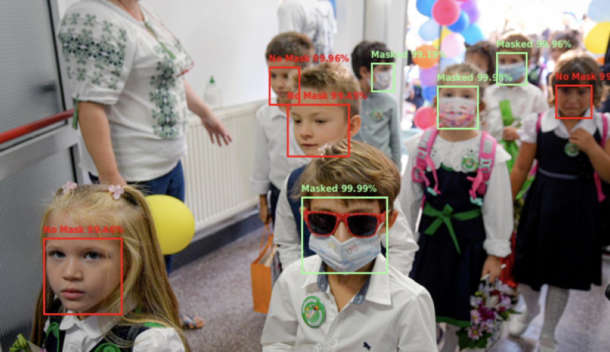

 
 
 

</a> 

 
     
       

# Face Mask Object Detection

## **About**

> Masks play a crucial role in protecting the health of individuals against respiratory diseases, as is one of the few precautions available for COVID-19 in the absence of immunization. Developing a real-time facial mask detection model may prove beneficial in identifying individuals who have worn masks amid the pandemic. 

* Create custom datasets, dataloaders and transformers for object detection tasks.
* Build object detection models to determine the boundary boxes of human faces, and to classify them into different classes. Implement performance metrics to keep tracking the training process.
* Apply the model on images, videos and live streams to accomplish real-time face mask detection.

## **Dataset**

All the training data used in this project are from [Face Mask Detection](https://www.kaggle.com/datasets/andrewmvd/face-mask-detection). This dataset contains 853 images belonging to the 3 classes (With mask, Without mask, and Mask worn incorrectly), as well as their bounding boxes in the PASCAL VOC format.

## **Training Process**

* **Dataset Setup:** Build a custom dataset for object detection tasks. Take images and annotation information from the original dataset and collate them all together.
* **Image Augmentation:** Apply mask augmentation methods for segmentation from `albumentations` (e.g. ShiftScaleRotate, RandomBrightnessContrast) on the train/val dataset.
* **Fine-Tuning Models:** Build the FastRCNN model for multi-class object detection. Implement custom mean IoU score functions.
* **Evaluation:** Evaluate the models on the test set and track the performance of the model.

## **Demonstration**
* **Image Output:**

* **Video Output:**

* **Live Stream Output:**

## **Reference**
> [1] Girshick, R. (2015, September 27). Fast R-CNN. arXiv.org. Retrieved March 20, 2023, from `https://arxiv.org/abs/1504.08083` 
>
> [2] Larxel. (2020, May 22). Face mask detection. Kaggle. Retrieved March 20, 2023, from `https://www.kaggle.com/datasets/andrewmvd/face-mask-detection` 
>
> [3] Techzizou. (2023, January 9). Train a custom Yolov4 object detector (using Google Colab). Medium. Retrieved March 20, 2023, from `https://medium.com/analytics-vidhya/train-a-custom-yolov4-object-detector-using-google-colab-61a659d4868` 

## **Licence**

This repository is licensed under the Apache-2.0 License - see the [LICENSE](https://github.com/Followb1ind1y/Face-Mask-Detection/LICENSE) file for details.
